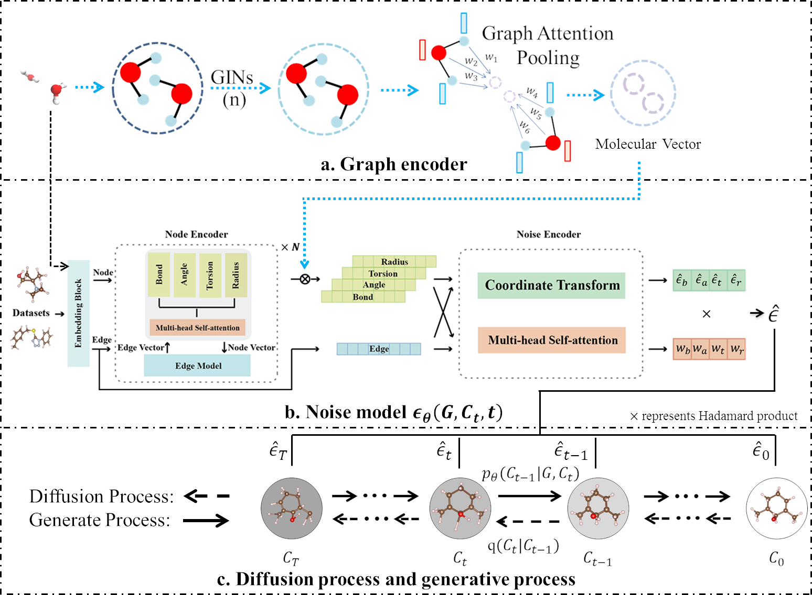

# GADIFF: A Transferable Graph Attention Diffusion Model for Generating Molecular Conformations

[](https://github.com/MinkaiXu/GeoDiff/blob/main/LICENSE)



## Environments

### Install via Conda (Recommended)

```bash
# Clone the environment
conda env create -f environment.yml
# Activate the environment
conda activate gadiff
```

## Dataset

### Offical Dataset
The offical raw GEOM dataset is avaiable [[here]](https://dataverse.harvard.edu/dataset.xhtml?persistentId=doi:10.7910/DVN/JNGTDF).

### Preprocessed dataset
We use the preprocessed datasets (GEOM) as that of GeoDiff, It dataset can be obtain through [[google drive folder]](https://drive.google.com/drive/folders/1b0kNBtck9VNrLRZxg6mckyVUpJA5rBHh?usp=sharing). The detailed usage are represented at [[GeoDiff]](https://github.com/MinkaiXu/GeoDiff).

## Training

The hyper-parameters and training details are provided in config files (`./configs/*.yml`), and free feel to tune these parameters.

You can train the model with the following commands:

```bash
# Default settings
python train.py ./config/qm9_para.yml
python train.py ./config/drugs_para.yml
```

The model checkpoints, configuration yaml file as well as training log will be saved into a directory specified by `--logdir` in `train.py`.

## Generation

We provide the checkpoints of two trained models, i.e., `qm9_default` and `drugs_default` in the [[google drive folder]](https://drive.google.com/drive/folders/1sCS89cpbtCBDaFLiggKrCmyFFIFW2Beo?usp=drive_link). Note that, please put the checkpoints `*.pt` into paths like `${log}/${model}/checkpoints/`, and also put corresponding configuration file `*.yml` into the upper level directory `${log}/${model}/`.

You can generate conformations for entire or part of test sets by:

```bash
python test.py ${log}/${model}/checkpoints/${iter}.pt \
    --start_idx 800 --end_idx 1000
```
Here `start_idx` and `end_idx` indicate the range of the test set that we want to use. All hyper-parameters related to sampling can be set in `test.py` files.

## Evaluation

After generating conformations following the above commands, the results of all benchmark tasks can be calculated based on the generated data.

### Task 1. Conformation Generation

The `COV` and `MAT` scores on the GEOM datasets can be calculated using the following commands:

```bash
python eval_covmat.py ${log}/${model}/${sample}/sample_all.pkl
```

### Task 2. Property Prediction

For the property prediction, we use a small split of qm9 different from the `Conformation Generation` task. This split is also used as the GeoDiff in the [[google drive folder]](https://drive.google.com/drive/folders/1b0kNBtck9VNrLRZxg6mckyVUpJA5rBHh?usp=sharing). Generating conformations and evaluate `mean  absolute errors (MAE)` metric on this split can be done by the following commands:

```bash
python ${log}/${model}/checkpoints/${iter}.pt --num_confs 50 \
      --start_idx 0 --test_set data/GEOM/QM9/qm9_property.pkl
python eval_prop.py --generated ${log}/${model}/${sample}/sample_all.pkl
```

## Acknowledgement

This repo is built upon the Diffusion framework of excellent work GeoDiff's [[codebase]](https://github.com/MinkaiXu/GeoDiff).

## Contact

If you have any question, please contact me at wangdh608@nenu.edu.cn.


